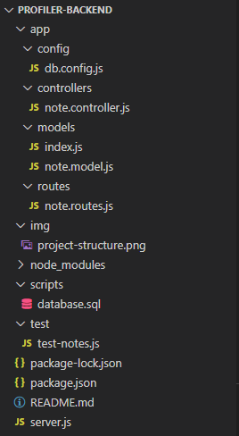

# profiler-backend

Github Profiler API.

### Project structure
This is our project structure


* Imports
  * express: Express is for building the Rest apis;
  * body-parser: helps to parse the request and create the req.body object;
  * cors: provides Express middleware to enable CORS with various options;
  * mysql2: MySQL client;
  * sequelize: Sequelize is a promise-based Node. js ORM for Postgres, MySQL, MariaDB, SQLite and Microsoft SQL Server;
  * mocha & chai: Test and assertion.
 
## First Run

After cloning from repo you need to install node dependencies with:
```bash
$ npm install
```

## Database
Create the database by running scripts/database.sql file in MySQL and edit app/config/db.config.js file.

## Running

You can start the server by running:
```bash
$ npm start
```
## Testing

You can test the API methods by running:
```bash
$ npm test
```
